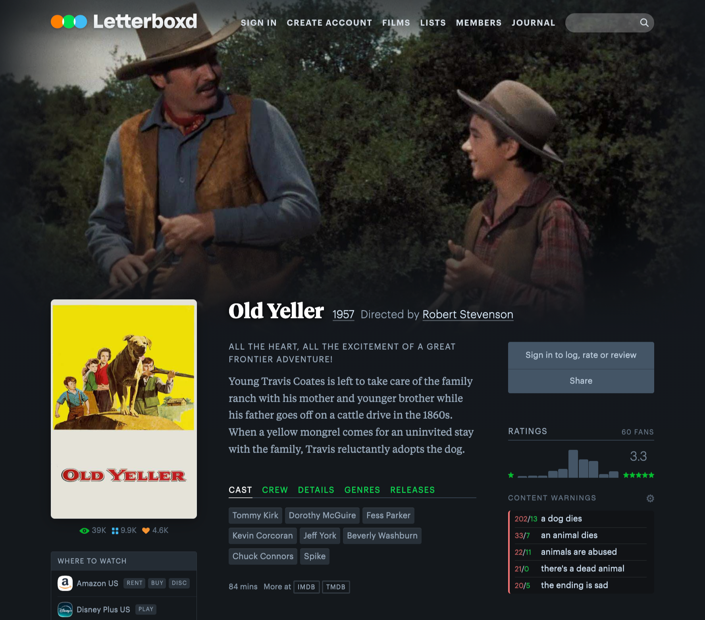
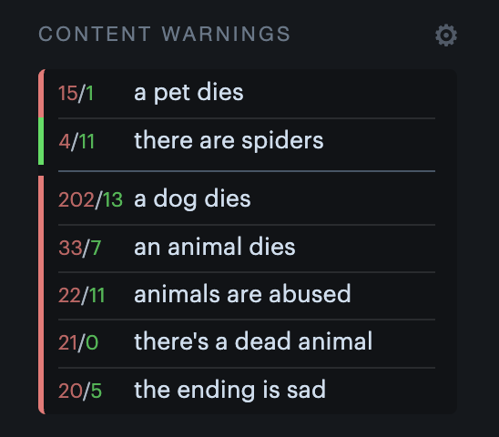
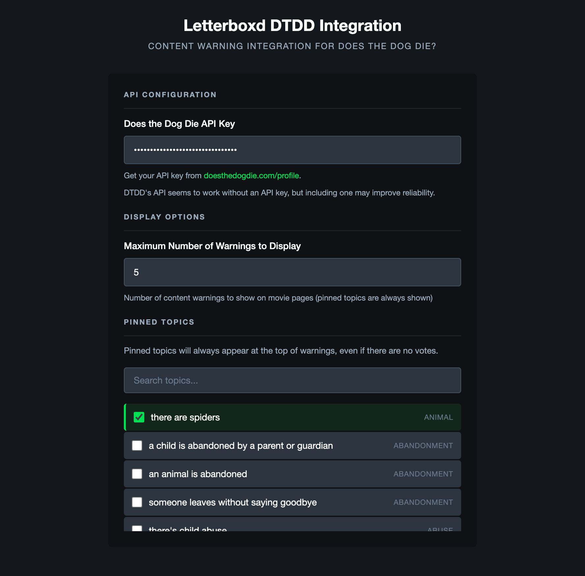

# Letterboxd Does The Dog Die Integration

A browser extension to extend Letterboxd's film page with content warnings crowdsourced by the [Does the Dog Die](https://www.doesthedogdie.com/) service. 

You can pin warnings to always see their status for a film.

Creating an account and API key from DTDD is recommended. The extension is not guaranteed to work without one. Once You may [find your API key here](https://www.doesthedogdie.com/profile).

## Screenshots
You can see the top content warnings below the ratings on the lower right side. The total number of DTDD users voting Yes/No is displayed next to the warning. The list is sorted by the highest count of "Yes" votes.

You can pin any number of warnings in order to always display their status, whether they are confirmed or denied.

As an example, here "there are spiders" and "a pet dies" are pinned warnings, of which, the film has "a pet dies" as confirmed but "there are spiders" isn't.

You can modify the extension settings to provide your DTDD API key, set the number of displayed warnings, and pin your desired warnings.

## Publishing
1. `./package.sh`
2. Upload at [Developer Dashboard](https://chrome.google.com/webstore/devconsole)
